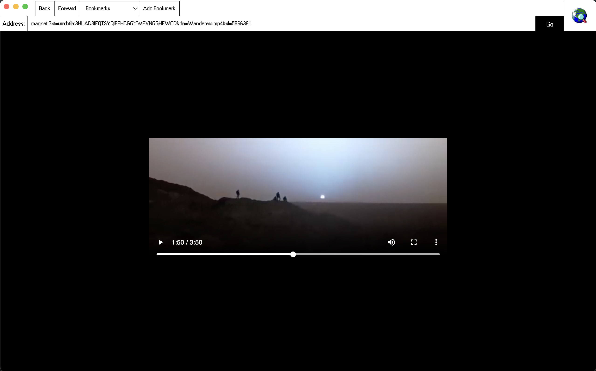
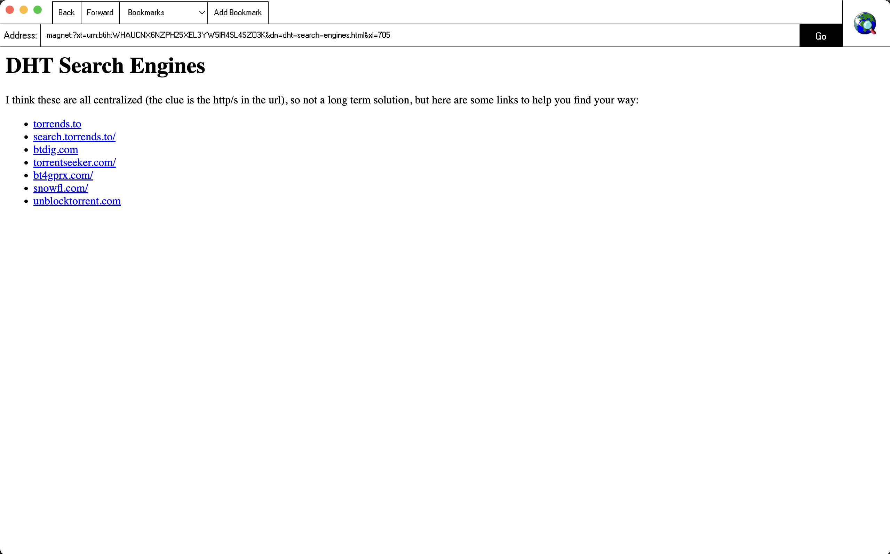

# Webtorrent Browser

DISCLAIMER: This software comes with no warranty, it is a proof of concept. Do not download html files randomly, they could contain malicious embedded javascript.

I have uploaded [release 0.1.1](https://github.com/wafwoof/webtorrent-browser/releases/tag/0.1.1) for folks running modern MacOS, but packaging for other platforms is very easy. I will work on building for more platforms soon.

## Gallery

## Why?

If the servers behind an http address go down: the website goes down.

If all the peers hosting a torrent go down: all you need is one person anywhere in the world to connect their copy of the file and it becomes accessible again.

If you don't use trackers and instead opt for just using kademlia: your files become almost impossible to censor.

Most people do not use torrents, I believe we should be making cool and weird experiements like this to get people excited and spread knowledge. The way that chrome has become a household name, some sort of solution for giving average people access to torrents, magnet links and dht's needs to become known by absolutely everybody. Death to 123freemovie.scam and sites of that sort, information and ideas should be easy to access, yet effectively difficult to extinguish.

Also, I have been having dreams about this technology and I need to get it off my laptop and my mind. At least temporarily. Basically this is my TempleOS.

## Pre-included Bookmarks

I have included some bookmarks to magnet links for testing purposes mainly.

The DHT search engine page I think is the best place to start. The Torrent2Magnet converter is also very useful.

## FAQ

- Can you watch torrented media with this?
  - Yes, anything chrome supports.
- How does this work?
  - Electron + Webtorrent + duct-tape.
- How do I create a torrent?
  - I have found deluge to be very simple for creating new .torrent files. One of the included bookmarks is a tool for converting this .torrent into a magnet link which you can browse, bookmark, or download/seed from a regular bittorrent client.
- Where do my files go when I create a torrent?
  - They go nowhere, at least not immediately. Typically the person who creates the torrent is also the very first host. As long as you are smart about mirroring your data or the files become very desireable: the torrent can exist without the initial uploader and could possibly live on for as long as the internet itself does.
- What is a seeder?
  - Someone who has downloaded at least a single piece of the overall file and is now returning the favor by uploading to other torrent clients.
- Does this software seed automatically?
  - Yes, all visited magnet links are seeded until the app is closed. They do not return until they are re-visited again.
  - Use a vpn, or only download free stuff.
- I encountered a bug, what do I do?
  - Sorry, I wish I had more time to iron this early early release out, but if you do find a bug: report it to me! My contact info is not hard to find from this repo.
- How can I delete this software?
  - Delete the torrent_download/ folder in your Downloads folder.
  - Delete the .app that you downloaded.
  - That's it, no fancy spyware, no time for that.
